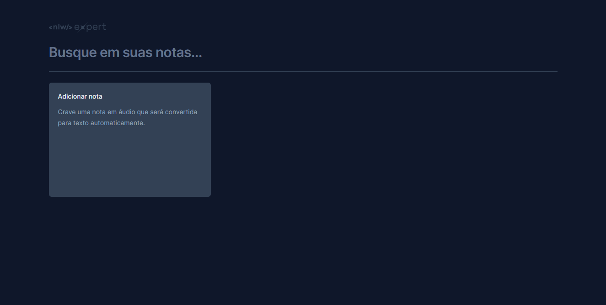
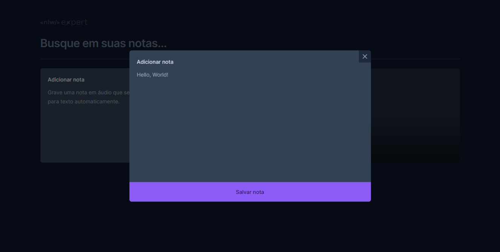
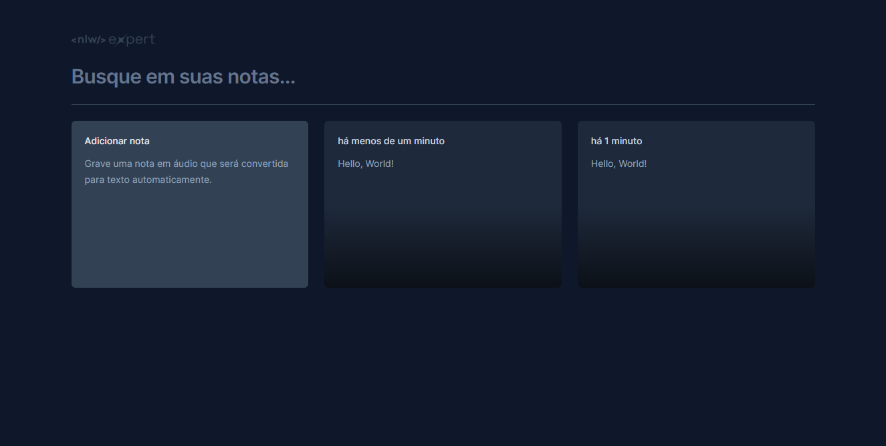
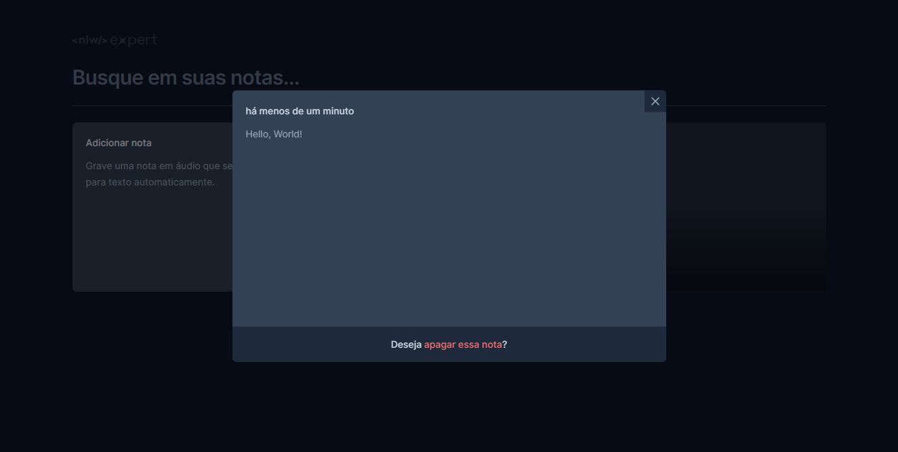
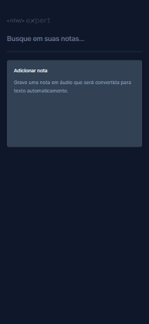
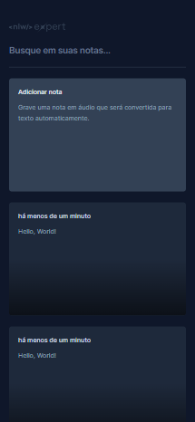
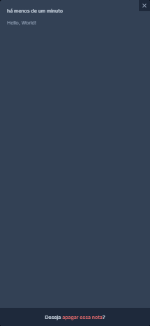

# NLW Expert React

A note management project developed during Rocketseat's NLW-Expert. <br>
You can save notes by typing or speaking.

## Web Version

<p width='100%' align='center'>
  
  
</p>
<p width='100%' align='center'>
  
  
</p>

## Mobile Version

<p width='100%' align='center'>
  
  
  
  
</p>

## Technologies

* Vite
* Tailwind CSS
* TypeScript
* ESLint
* Prettier
* Speech Recognition

## 🤖 Demo

You can view the project demo at [https://nlw-expert-react-guilherme-arruda.vercel.app](https://nlw-expert-react-guilherme-arruda.vercel.app).

## 🚀 Getting Started

To run the project in your machine you can clone this repository locally in a directory of your choice using:

```
git clone https://github.com/Guilherme-Arruda/NLW-Expert-React.git
```

After cloning you need to install all dependencies using:

```bash
npm install
# or
yarn
```

Then you can finally run the project using:

```bash
npm run dev
# or
yarn dev
```

## 📄 License

This project is under MIT license - see the file [LICENSE.md](https://github.com/Guilherme-Arruda/NLW-Expert-React/blob/master/LICENSE) for details.

---

##### Coded with love by Guilherme Arruda ♥️
